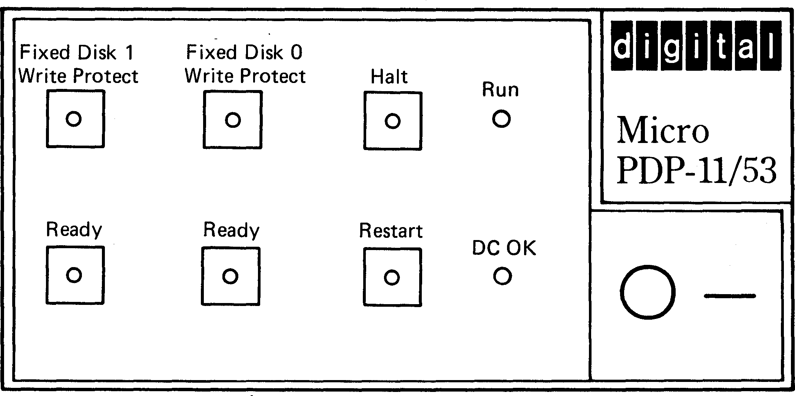

# MicroPiDP-11/93

## Design

The design is inspired by the 6-button version of the [BA23 enclosure](https://gunkies.org/wiki/BA23_Enclosure). Instead of the floppy or tape drive bay there is a bay that fits a Raspberry PI lengthwise so there is easy access to hdmi port etc.

## Hardware

* Rocker switch 2-p on-off 250VAC 16A: [https://www.electrokit.com/en/vagomkopplare-2-pol-on-off-i/o-1](https://www.electrokit.com/en/vagomkopplare-2-pol-on-off-i/o-1)
* Push button PCB 2-pole on-on: [https://www.electrokit.com/en/tryckknapp-pcb-2-pol-on-on](https://www.electrokit.com/en/tryckknapp-pcb-2-pol-on-on)
* Push button PCB 2-pole on-(on): [https://www.electrokit.com/en/tryckknapp-pcb-2-pol-on-on-1](https://www.electrokit.com/en/tryckknapp-pcb-2-pol-on-on-1)
* 6 heat insert M3. Modify the scad file to fit your heat inserts.

The Restart button is a momentary, on-(on), push button and the rest is latching, on-on, push buttons. Se picture below for reference.

